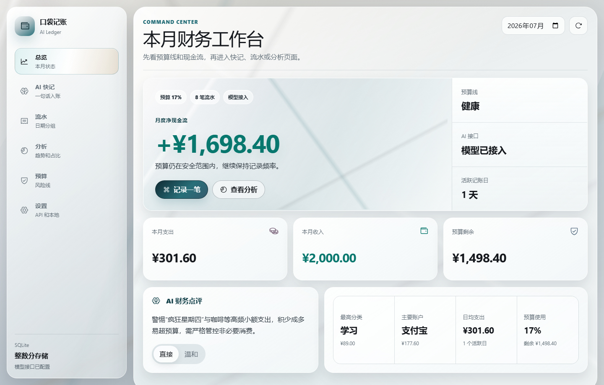
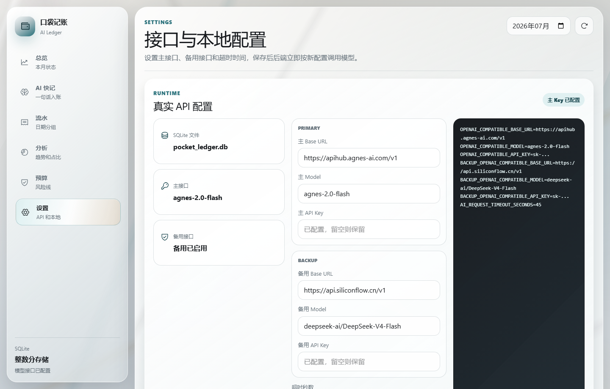

# 口袋记账 AI 版

一个面向学生日常消费场景的 AI 记账 Web 产品。用户输入一句中文消费记录，系统会解析金额、分类、账户、时间、备注和标签，用户确认后写入 SQLite，并在总览、流水、分析、预算和设置页面中查看结果。

项目重点不是“套一个 AI 接口”，而是展示完整的 AI 协作开发能力：需求拆解、竞品借鉴、提示词设计、结构化 JSON 解析、本地兜底、主备模型容灾、金额精度、SQLite 持久化、可解释的协作日志和可复现的工程验收。

## 界面预览





## 核心功能

- 一句话记账：输入“今天中午和室友吃疯狂星期四花了 50 块，微信付的”，解析为结构化账单草稿。
- 用户确认入账：AI 只生成草稿，不直接写数据库。
- 本地规则兜底：无 Key、模型超时或模型返回异常时，仍可解析常见中文记账句子。
- 主备模型容灾：主 OpenAI 兼容接口失败后自动尝试备用接口。
- 真实设置页面：可保存并测试主接口、备用接口、模型名、Base URL 和超时时间。
- SQLite 持久化：本地数据库保存账单、预算和运行配置。
- 金额精度：金额统一以整数“分”保存，避免浮点误差。
- 日期分组流水：按天分割流水，组头显示当天笔数、支出、收入和净额。
- 自定义标签：每笔账支持多个标签，例如“社交”“小额高频”“宿舍”。
- 文字化图表：图表旁配有结论文字，不只展示图形。
- 分页面工作台：总览、AI 快记、流水、分析、预算、设置独立切换。

## 技术栈

- 前端：Vite、React、TypeScript、Tailwind CSS、Recharts、Phosphor Icons
- 后端：FastAPI、SQLite、Pydantic、httpx
- AI：OpenAI 兼容 Chat Completions 接口，支持主备模型
- 测试：pytest、Playwright 浏览器检查

## 目录结构

```text
backend/          FastAPI 后端、SQLite、AI 解析、测试
frontend/         React 前端应用
docs/             产品规格、设计系统、接口、部署、演示和答辩文档
AI_LOG.md         AI 协作日志
PRODUCT.md        产品与设计上下文
README.md         项目入口
render.yaml       Render 后端部署参考配置
```

## 本地运行

### 后端

```powershell
cd backend
python -m venv .venv
.\.venv\Scripts\Activate.ps1
pip install -r requirements.txt
copy ..\.env.example .env
python -m app.main
```

默认地址：

```text
http://localhost:8000
```

接口文档：

```text
http://localhost:8000/docs
```

如果 `8000` 被占用，可以改用 `8001`：

```powershell
python -m uvicorn app.main:app --host 127.0.0.1 --port 8001
```

### 前端

```powershell
cd frontend
npm install
npm run dev
```

默认地址：

```text
http://localhost:5173
```

如果后端不是 `8000`，在 `frontend/.env.local` 写入：

```env
VITE_API_BASE_URL=http://127.0.0.1:8001
```

## AI 接口配置

网页设置页可以直接保存真实运行配置。配置写入 SQLite 的 `app_settings` 表，不会通过公开接口回显真实 Key。

也可以复制 `.env.example` 到 `backend/.env`，作为初始配置：

```env
POCKET_LEDGER_DB_PATH=data/pocket_ledger.db
OPENAI_COMPATIBLE_API_KEY=你的主接口密钥
OPENAI_COMPATIBLE_BASE_URL=https://api.openai.com/v1
OPENAI_COMPATIBLE_MODEL=你的主模型名
BACKUP_OPENAI_COMPATIBLE_API_KEY=你的备用接口密钥
BACKUP_OPENAI_COMPATIBLE_BASE_URL=https://api.siliconflow.cn/v1
BACKUP_OPENAI_COMPATIBLE_MODEL=你的备用模型名
AI_REQUEST_TIMEOUT_SECONDS=45
CORS_ALLOWED_ORIGINS=http://localhost:5173,http://127.0.0.1:5173
```

不配置密钥时，系统仍可运行，会使用本地规则解析常见中文记账句子。

## 测试

```powershell
cd backend
.\.venv\Scripts\Activate.ps1
pytest
```

当前覆盖重点：

- 金额字符串转整数分
- AI 解析失败后的本地兜底
- 主模型失败后的备用模型调用
- 主备接口测试不泄露 Key
- 账单增删改查
- 预算统计和超支状态

前端生产构建：

```powershell
cd frontend
npm run build
```

## 演示流程

完整讲解脚本见 `docs/DEMO_SCRIPT.md`。3 分钟内建议按这个顺序演示：

1. 总览页：展示本月收入、支出、预算剩余和 AI 建议。
2. AI 快记：输入一句自然语言，展示结构化解析结果。
3. 确认入账：说明 AI 不直接写库，必须用户确认。
4. 流水和分析：展示日期分组、标签、分类占比和趋势文字。
5. 预算页：展示预算风险和温和/直接建议。
6. 设置页：测试主接口和备用接口，说明 Key 不回显、失败可兜底。

## 部署

推荐前后端分离部署：

- 前端：Vercel，Root Directory 选择 `frontend`，Build Command 为 `npm run build`，Output Directory 为 `dist`。
- 后端：Render Web Service，参考根目录 `render.yaml`。
- 线上环境变量和持久化注意事项见 `docs/DEPLOYMENT.md`。

## 答辩关注点

- 为什么用 SQLite：单用户演示无需额外数据库服务，本地文件持久化，代码可解释。
- 为什么金额存分：货币计算不能用浮点数保存。
- 为什么 AI 不直接入账：模型输出可能错，必须用户确认。
- 本地兜底怎么做：金额用规则解析，分类和账户用关键词字典识别，缺字段会降低置信度。
- API 失败怎么办：先主模型，再备用模型，最后本地规则和手动记账兜底。
- Key 怎么保护：真实 Key 只存后端环境变量或 SQLite，不通过公开接口返回。

