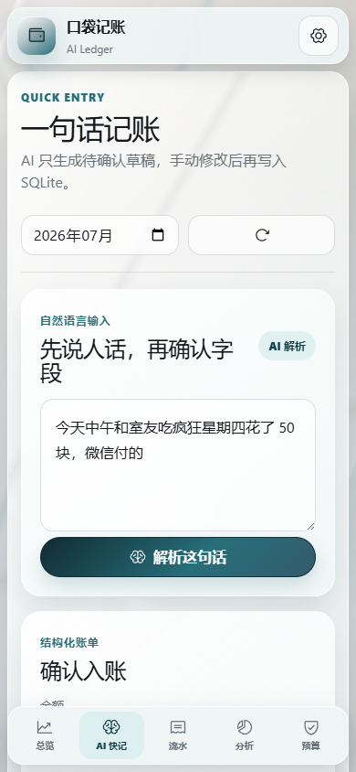
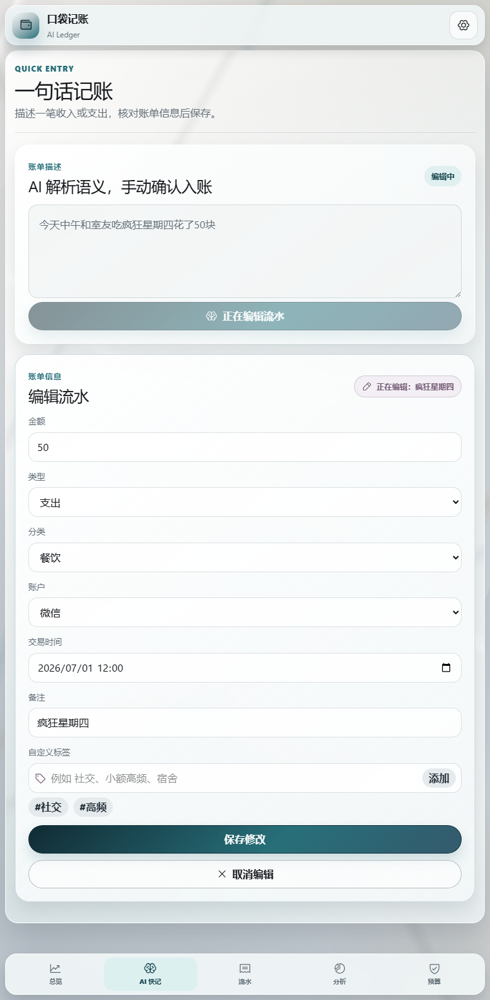

# 口袋记账 AI 版

面向学生和年轻用户的 AI 记账 Web 应用。用户可以输入一句中文收支记录，由 OpenAI 兼容模型解析为结构化草稿，确认后写入 SQLite；模型不可用时，系统会回落到可解释的本地规则。当前公开部署使用 Groq 上的 Qwen 3.6 作为低延迟主模型，代码仍保留可选备用 Provider 能力。

## 人机协作摘要

- 人负责产品目标、范围取舍、安全边界和最终验收，AI 不替代产品决策。
- AI 参与方案整理、代码实现、故障诊断、测试设计与文档维护，每次关键改动都由测试或浏览器结果验证。
- 产品内的模型只生成待确认账单和财务建议，不能绕过用户直接写入数据库。
- 可追溯证据集中在 [AI 协同开发日志](AI_LOG.md)，不以聊天记录数量代替工程结果。

## 在线入口

- 在线演示：[pocket-ledger-ai.vercel.app](https://pocket-ledger-ai.vercel.app/)
- GitHub：[Super-Ice-Knight/pocket-ledger-ai](https://github.com/Super-Ice-Knight/pocket-ledger-ai)
- 后端服务（休眠时显示 Render 唤醒页，启动后返回 JSON）：[pocket-ledger-ai.onrender.com](https://pocket-ledger-ai.onrender.com/)
- 健康检查：[GET /api/health](https://pocket-ledger-ai.onrender.com/api/health)
- Swagger 文档：[FastAPI /docs](https://pocket-ledger-ai.onrender.com/docs)

Render 免费实例在闲置后会休眠，首次访问可能需要约一分钟唤醒。线上 SQLite 仅用于功能演示，不承诺长期保存用户数据；具体清空条件见下方“线上数据保存限制”。

## 线上数据保存限制

公开演示使用的是保存在 Render Web Service 本地文件系统中的 SQLite 文件，并不是带持久化保证的托管数据库。Render 免费 Web Service 使用临时文件系统，因此线上数据**没有最低保存时长保证**，不能理解为会固定保存几小时或几天。

- **闲置休眠**：服务连续约 15 分钟没有收到请求后会休眠。本地 SQLite 会随当前实例文件系统一起丢失，下次访问唤醒的是重新初始化的实例。
- **重新部署**：推送 GitHub 后触发 Auto-Deploy、手动 Deploy，以及部分环境变量修改引发的重新部署，都会创建新实例并清空原 SQLite。
- **服务重启**：手动重启、平台维护或 Render 主动重启免费实例时，SQLite 同样可能被清空。即使服务持续有人访问，也不能把免费实例当作长期数据存储。
- **不会直接清空的操作**：刷新浏览器、切换页面、普通查询和关闭浏览器本身不会主动删除数据；但刷新可能恰好唤醒一个已经休眠并重置的后端实例。

数据库重置后，后端会重新创建表。若 Render 环境变量设置了 `SEED_DEMO_DATA=true`，新数据库会自动写入一组演示流水；设为 `false` 或未配置时，新数据库保持为空。因此线上演示数据随时可能恢复为初始样例，而访客新建、编辑的记录不保证在下一次访问时仍然存在。

本地运行不受上述限制：SQLite 默认保存在 `backend/data/pocket_ledger.db`，只要用户不删除该文件，关闭并重启前后端不会清空账本。需要线上长期保存时，应改用外部 PostgreSQL 等持久化数据库，或为付费 Render 服务挂载 Persistent Disk。详见 [Render 免费服务限制](https://render.com/docs/free) 与 [项目部署说明](docs/DEPLOYMENT.md)。

## 30 秒验收路径

- **新建账单**：`AI 快记` → 输入一笔收入或支出 → `解析账单` → 核对金额、分类、账户和记账时间 → `确认入账`。
- **编辑账单**：`流水` → 点击目标流水右侧铅笔 → 进入 `编辑流水` → 修改后选择 `保存修改`，或用 `取消编辑` 放弃本次修改。

## 界面预览


<table>
  <tr>
    <th>手机 AI 快记</th>
    <th>流水编辑</th>
  </tr>
  <tr>
    <td></td>
    <td></td>
  </tr>
</table>

## 核心能力

- 一句话记账：解析金额、类型、分类、账户、时间、备注和标签；AI 推断时间会进入可编辑表单。
- 确认后入账：AI 只生成草稿，用户确认后才写数据库。
- 安全草稿状态：解析后继续修改原描述会使旧草稿过期，重新解析前不能误提交。
- 可选主备模型：配置备用接口后自动容灾；未配置时直接回落本地规则。
- 本地兜底：所有已配置 Provider 都不可用时，使用确定性规则完成常见句子解析。
- AI 财务点评：由用户手动触发模型，输出一句话结论、详细分析和行动建议；结果持久化到 SQLite，数据未变时直接读取缓存。
- 整数分存储：金额统一保存为整数“分”，避免浮点误差。
- 金额边界：单笔交易必须在 `0.01–99,999,999.99` 元之间，前端、API 和 SQLite 共同阻止 0 元及异常大额。
- 北京时间账本：记账时间统一归一为 `Asia/Shanghai` 的 `+08:00` ISO 时间，月、周和日期分组按业务日期计算。
- 月/周流水：可切换月度与周度统计，按天展示笔数、收入、支出、净额和自定义标签；跨月周仍按周一到周日完整计算。
- 预算与分析：预算风险、消费趋势、分类占比和账户分布均配有文字结论。
- 响应式工作台：桌面长页面中侧栏底板与主工作区等高、导航保持在视口；平板改为上下布局，手机使用顶部设置和底部五项导航。
- 真实设置：本地环境可保存主备 API；公开演示环境只读，Key 由 Render 环境变量管理。
- 故障反馈：Render 冷启动、网络错误、模型失败和非法输入都有明确恢复路径。

## AI 快记流程

```text
自然语言
   ↓
主模型（OpenAI 兼容接口）
   ↓ 失败
备用模型（可选）
   ↓ 失败
本地确定性规则
   ↓
字段归一化与 Pydantic 校验
   ↓
待确认草稿
   ↓ 用户确认
SQLite
```

本地金额规则不是简单取第一个数字。系统优先识别“50元/50块”，再识别“花了50、收入2000、共50”等金额语境；日期和数量同时出现但金额不明确时，会把金额标记为缺失。多个金额、外币、千位分隔符、无法确定的明确日期或冲突收支语义也不会由规则强猜，用户补齐字段后才能确认入账。

AI 点评不跟随页面加载、普通刷新或每次入账自动调用模型。总览和预算页只读取当前月份与语气的已保存结果；账单、预算、模型配置或 Prompt 版本变化时，旧结果会标记为“待更新”，只有点击“生成点评/重新分析”才会发起新的模型请求。

当前公开部署使用 Groq `qwen/qwen3.6-27b`，请求超时为 10 秒。2026-07-13 的单次线上验收中，真实快记和结构化点评均成功返回主模型结果；这只是验收样本，不是可用性或延迟 SLA。线上暂不配置未经验证的慢备用接口，Provider 日志也不记录 Key 或完整账单原文。详细延迟分层与迁移过程见 [AI_LOG.md](AI_LOG.md) 和 [docs/DEFENSE_NOTES.md](docs/DEFENSE_NOTES.md)。

## 技术结构

- 前端：Vite、React、TypeScript、Tailwind CSS、Recharts、Phosphor Icons
- 后端：FastAPI、SQLite、Pydantic、httpx
- AI：OpenAI 兼容 Chat Completions，支持主模型、备用模型和本地兜底
- 验证：pytest、TypeScript 构建、Playwright 桌面与手机检查

```text
frontend/              React 前端
backend/app/           FastAPI、SQLite、AI 与统计逻辑
backend/tests/         后端行为测试
docs/                  产品、接口、部署、演示与答辩文档
AI_LOG.md              AI 协同开发日志
render.yaml            Render 部署配置
```

## 任务书覆盖矩阵

| 任务书关注点 | 当前实现 | 验收证据 |
|---|---|---|
| 金额、分类、账户、时间、备注 | 共用确认/编辑表单，记账时间可修改 | 35 项 pytest、7 项 Playwright |
| 流水与基础统计 | 月/周切换、日期分组、收支净额、分类与账户分析 | 跨月周与请求竞态测试 |
| 一句话记账 | 固定 JSON、字段归一化、缺失字段提示、确认后入库 | 主模型、备用链路与本地兜底测试 |
| 智能预算与点评 | 手动生成、详细分析、行动建议、SQLite 指纹缓存 | `fresh/stale/missing` 缓存测试 |
| 非法输入与 API 故障 | 前后端金额边界、日期校验、中文错误与 Provider 兜底 | 422、超时、非法 JSON 与双模型失败测试 |
| 持久化与金额精度 | SQLite + 整数分存储 | `0.1 + 0.2`、`12.60` 和跨月统计测试 |
| AI 协作过程 | 决策、Prompt、采纳/拒绝、Debug 与提交索引 | [AI_LOG.md](AI_LOG.md) |

## 已验证运行环境

- Python `3.11.9`
- Node.js `v24.11.1`
- npm `11.6.2`
- Windows PowerShell

## 本地运行

### 1. 后端

```powershell
cd backend
py -3.11 -m venv .venv
.\.venv\Scripts\Activate.ps1
python -m pip install -r requirements.txt
copy ..\.env.example .env
python -m uvicorn app.main:app --host 127.0.0.1 --port 8000
```

后端地址为 `http://127.0.0.1:8000`，接口文档为 `http://127.0.0.1:8000/docs`。
Windows 下显式使用 `py -3.11` 创建虚拟环境，避免系统默认 Python 3.14 导致已知的依赖构建问题。

### 2. 前端

```powershell
cd frontend
npm ci
npm run dev
```

默认访问 `http://127.0.0.1:5173`。如果后端运行在其他端口，在 `frontend/.env.local` 中设置：

```env
VITE_API_BASE_URL=http://127.0.0.1:8001
```

## AI 配置

复制根目录 `.env.example` 为 `backend/.env`，填写自己的 Key：

```env
OPENAI_COMPATIBLE_BASE_URL=https://api.groq.com/openai/v1
OPENAI_COMPATIBLE_MODEL=qwen/qwen3.6-27b
OPENAI_COMPATIBLE_API_KEY=
BACKUP_OPENAI_COMPATIBLE_BASE_URL=
BACKUP_OPENAI_COMPATIBLE_MODEL=
BACKUP_OPENAI_COMPATIBLE_API_KEY=
AI_REQUEST_TIMEOUT_SECONDS=10
RUNTIME_AI_SETTINGS_WRITABLE=true
SEED_DEMO_DATA=false
```

备用 Provider 是可选项，只有在独立测试确认延迟和 JSON 输出都合格后才应填写。不要为了展示“主备”而把已知慢接口留在关键链路中。本地默认允许设置页写入 SQLite；公开部署应设置 `RUNTIME_AI_SETTINGS_WRITABLE=false`，并把密钥保存在 Render 环境变量中，避免访客修改运行配置。

不配置任何 Key 时应用仍能运行，但 AI 快记和财务点评会明确显示“本地规则”来源。

`SEED_DEMO_DATA=true` 只用于首次体验或公开演示。在同一个本地或持久化数据库中，种子记录只会初始化一次，用户删除全部流水后普通重启不会自动恢复；Render 免费实例若丢失了整个 SQLite 文件，下次创建的新数据库会重新写入演示数据。个人账本建议保持 `false`。

## 验证

后端测试：

```powershell
cd backend
.\.venv\Scripts\python.exe -m pytest -q
```

当前覆盖 35 项后端行为，包括金额上下界、北京时间与 UTC 跨日、编辑后跨周/跨月统计、演示数据只初始化一次、月份参数校验、AI 缺失字段重算、安全日志、金额精度、主备切换、双模型失败兜底、设置只读、Key 防泄漏，以及多个金额、外币、千位分隔符、明确日期和冲突收支语义等异常输入。

模型正常时已经实测识别“昨天兼职收入两千元”为 200000 分；确定性本地兜底目前只承诺阿拉伯数字金额。一句话快记当前对应一笔账，同时包含收入和支出的句子应拆成两次输入，月度统计会自动计算净额；本地兜底遇到冲突时会要求用户重新选择收支类型。

前端构建：

```powershell
cd frontend
npm run build
```

前端自动化：

```powershell
cd frontend
npm ci
npx playwright install chromium
npm test
```

当前 7 项 Playwright 测试覆盖金额与时间转换、旧 AI 草稿失效、记账时间修改后提交、取消编辑、月度请求乱序、显式确认“其他”分类、补齐冲突收支与时间，以及 `1440×900` / `390×844` 六页面溢出检查。

完整发布检查见 [docs/RELEASE_CHECKLIST.md](docs/RELEASE_CHECKLIST.md)。

## 三分钟演示

1. 总览：现金流、预算状态，并手动生成一次带 provider 标记的 AI 点评。
2. AI 快记：输入自然语言，检查结构化草稿与来源。
3. 确认入账：强调 AI 不直接写库。
4. 流水与分析：切换月度/周度统计，展示日期分组、标签、图表和文字结论。
5. 设置：展示 Groq 主模型测试和公开演示只读边界。
6. 工程说明：整数分、SQLite、点评指纹缓存、可选 Provider 容灾和本地规则。

录制前预热步骤与逐段讲稿见 [docs/DEMO_SCRIPT.md](docs/DEMO_SCRIPT.md)。

## 答辩资料

- [AI 协同开发日志](AI_LOG.md)
- [产品规格](docs/PRODUCT_SPEC.md)
- [API 契约](docs/API_SPEC.md)
- [部署说明](docs/DEPLOYMENT.md)
- [答辩备忘](docs/DEFENSE_NOTES.md)
- [开发流水](docs/DEV_LOG.md)

## 数据与安全边界

- 第一版为单用户演示，不包含登录和多用户权限。
- API Key 不通过公开接口回显，也不提交到 GitHub。
- 公开演示关闭运行时配置写入；本地环境保留真实设置能力。
- 线上 SQLite 没有最低保存时长保证，会在免费 Render 实例休眠、重新部署或重启时重置，因此线上仅用于体验，本地版本用于可靠持久化与完整答辩。
- 不包含银行同步、OCR、语音输入、原生 App 或复杂资产管理。
